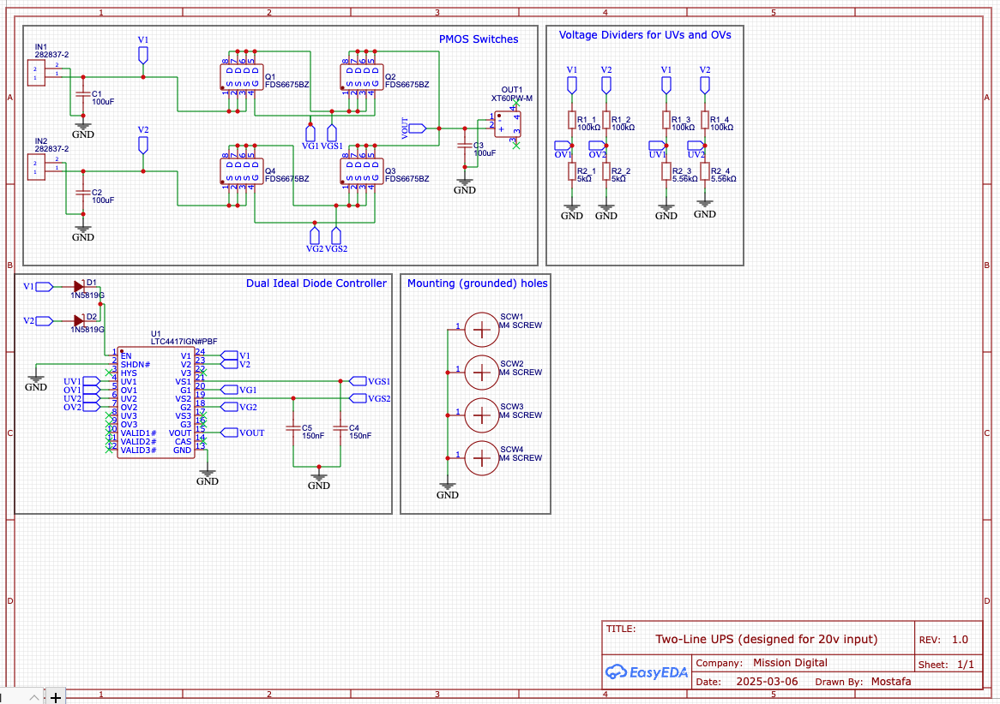
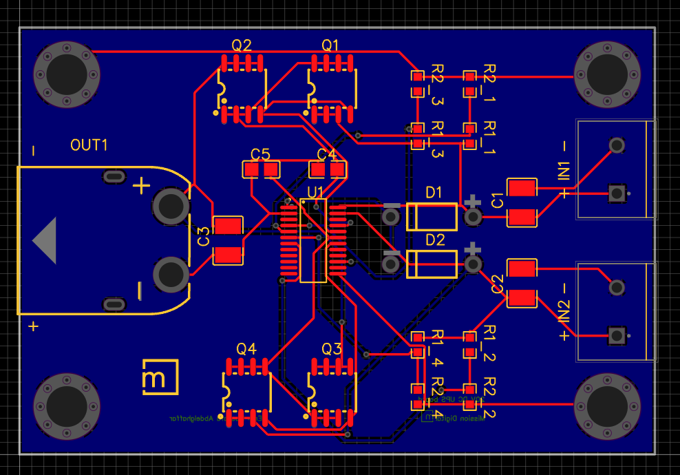
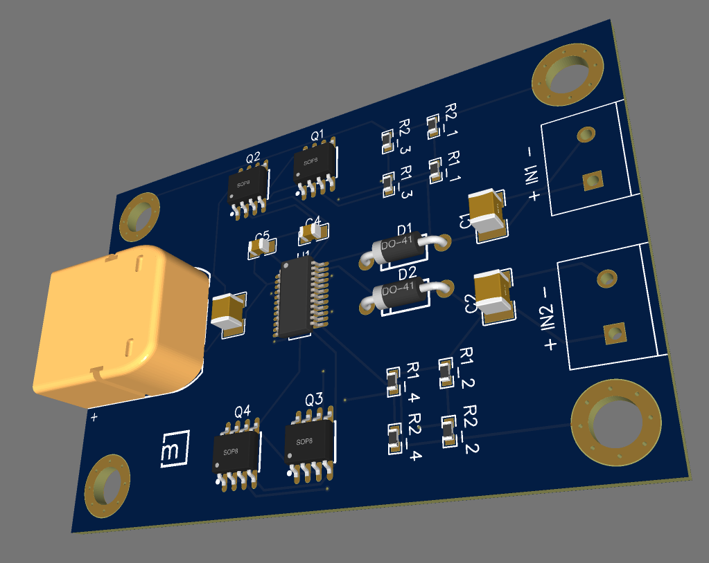

# DC UPS

## Introduction

PCB designing of a UPS (uninterrupted power source) made for taking 20V inputs from two different sources and when plugging one then unplugging the other, that wouldn't hurt anything in the circuit at all. 

## Schematic

  

## PCB

  

## 3D PCB

  

