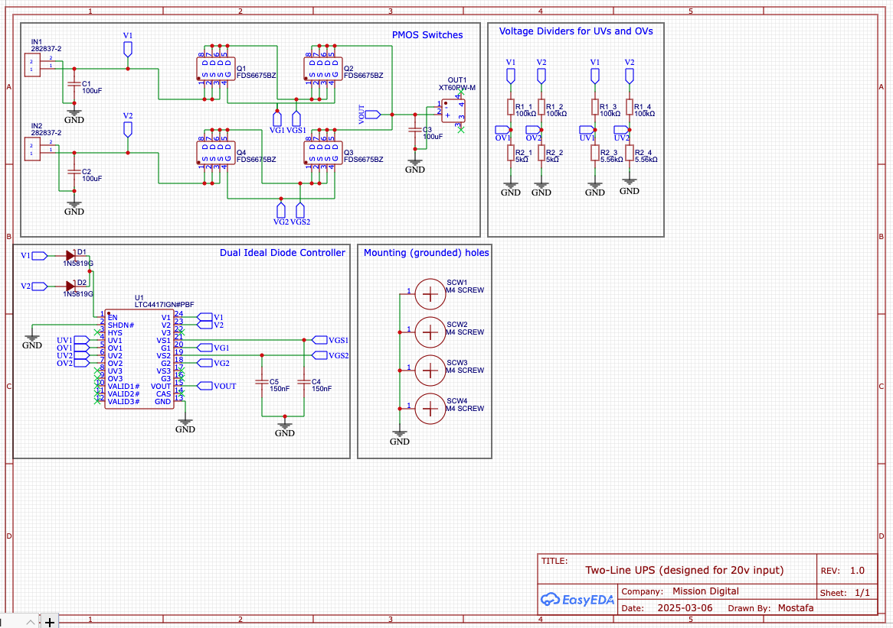
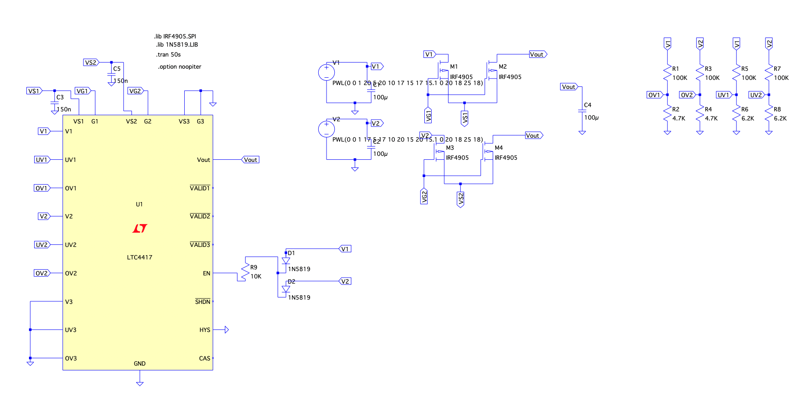
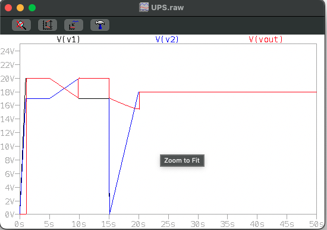

# DC UPS

## Introduction

PCB designing of a UPS (uninterrupted power source) made for taking 20V inputs from two different sources and when plugging one then unplugging the other, that wouldn't hurt anything in the circuit at all. 

The following is the initial design of the UPS Using back-to-back PMOS Transistors and the common gate as well as the common gate-source are connected in the Prioritised PowerPath Controller.

## Schematic

  

## PCB

  

## 3D PCB

  

A simulation using LTSPice tool to simulate the circuit and make sure that it is working properly was done and the result can be viewed as following:

  

V1 and V2 are voltage supplies with piecewise linear (PWL) function to select different values to make sure that the Prioritised PowerPath Controller are working as intended.
The values were chosen to test all cases, switching between power source 1 and 2. and testing behaviour when the values exceed the max limit and decrease beneath the minimum limit.

  

The initial design lacked decoupling capacitors that suppress high frequency noise and fluctuations in power supply signals. Therefore, a thorough research was done on the capacitors to know more about decoupling capacitors as they are connected in parallel to reduce the ESL, equivalent series inductance reducing the stress on each capacitors by having multiple paths reducing noise and improving the power supply stability further.
Furthermore, the bulk capacitor's value was not high enough. Even though the power sources were designed to be coming from a DCDC buck-boot converters and those converters have 3x 3000uF by the output. Yet, to be in the safe side and have a bulk capacitor that store electrical energy and stabilize voltage incase of fluctuating power or transient current demands. a Bulk Capacitor of 1000uF was introduced in V1.2 

That lead to the following schematic design:

## Schematic

  

## PCB

  

## 3D PCB

  

